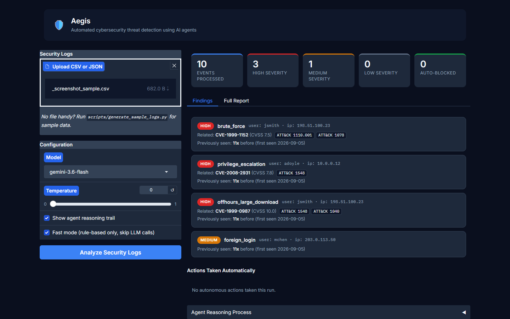
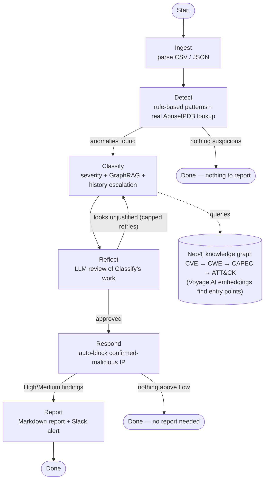

# Aegis

**AI Cyber Defense Multi-Agent System.** A 6-stage LangGraph pipeline — Ingest → Detect → Classify → Reflect → Respond → Report — built on Google Gemini, with a GraphRAG layer (Neo4j + Voyage AI) grounding threat classification in real CVE/CWE/CAPEC/ATT&CK data, and persistent cross-run memory that measurably escalates severity for recurring threats.

Aegis is a **decision-support system**: it detects and triages security incidents from log data and produces a prioritized incident report for a human analyst to act on. The one narrow exception is auto-blocking a confirmed-malicious IP to a local blocklist — every other recommended action (password resets, system isolation, access reviews) always waits for a human.

**Status: all four build phases complete and verified against live services** — real Gemini, real AbuseIPDB, real Slack, real Neo4j Aura + Voyage AI over real NVD/MITRE data, real persistent memory. Not a scaffold. See [PROJECT_DOCUMENTATION.md](./PROJECT_DOCUMENTATION.md) for the full build history, every decision made, and every real bug found and fixed along the way.



## Why I built this

I wanted a portfolio project that was genuinely agentic — not a single prompt-to-response wrapper, but a multi-agent pipeline that makes real decisions with real consequences: escalating severity based on live threat data, catching its own bad judgment calls, and taking one narrow autonomous action. Every integration in Aegis (Gemini, AbuseIPDB, Slack, Neo4j, Voyage AI) is wired to the live service, not mocked, because the interesting bugs — and the interesting engineering — only show up once real APIs, real rate limits, and real data are in the loop. `PROJECT_DOCUMENTATION.md` keeps a running log of exactly what broke and why, on the theory that the debugging story is more informative than a clean diff.

Two moments stood out while building it. First, Aegis's own Reflect agent caught a real bug in Classify — a blanket "every sudo command is High severity" rule — by correctly arguing that routine maintenance shouldn't be flagged the same as a suspicious privilege escalation, which is exactly the alert-fatigue problem the project exists to reduce. Second, verifying the CVE→CWE→ATT&CK bridge required abandoning my original assumption (a direct CWE-to-ATT&CK mapping) once research showed MITRE's real bridge runs through CAPEC — a reminder to verify domain assumptions against primary sources before building on them.

## What it does

Give it a CSV or JSON security log file. It will:

1. **Detect** brute-force logins, privilege escalation, off-hours large downloads, and foreign logins using deterministic rules plus real AbuseIPDB threat-intelligence lookups.
2. **Classify** each finding's severity, enriched with real CVE/CWE/ATT&CK context retrieved from a knowledge graph (GraphRAG) — a finding gets escalated when it matches a real, high-severity CVE.
3. **Reflect** on its own findings before acting — an LLM-driven critique step that can send a finding back for re-analysis if the assigned severity looks unjustified (with a retry cap).
4. **Respond** by auto-blocking a confirmed-malicious IP to a local blocklist — the *only* thing it does autonomously. Everything else becomes a recommendation.
5. **Report**: a Markdown incident report citing real CVE IDs, ATT&CK techniques, and recurrence history ("flagged 3x before"), plus a Slack alert on High-severity findings.
6. **Remember**: every run's findings feed a persistent SQLite history, so a pattern that keeps recurring across separate runs gets treated as more serious over time.

## Quickstart

```bash
python -m venv .venv
source .venv/bin/activate  # or .venv\Scripts\activate on Windows
pip install -r requirements.txt

cp .env.example .env
# Fill in GEMINI_API_KEY at minimum (get one at https://aistudio.google.com/apikey).
# Everything else (AbuseIPDB, Slack, Voyage AI, Neo4j) is optional — Aegis
# degrades gracefully to rule-based-only behavior for anything not configured.

python scripts/generate_sample_logs.py   # synthetic test data with planted anomalies
python -m src.incident_agents.run --logs data/security_logs.csv --show-reasoning
```

Or the web UI:

```bash
python run_gradio_app.py
# → http://localhost:7860
```

## Architecture

This is the actual `StateGraph` wired in [`graph.py`](./src/incident_agents/graph.py) — not a simplified sketch. The two loops that matter: Reflect can send work back to Classify (capped retries), and both Detect and Respond can short-circuit straight to done when there's nothing worth escalating.



## Stack

| Layer | Choice | Status |
|---|---|---|
| Orchestration | LangGraph (StateGraph, conditional edges, reflection loop) | ✅ |
| LLM | Google Gemini (`gemini-3.6-flash` default) | ✅ live |
| Threat intel | AbuseIPDB (`/check` endpoint) | ✅ live |
| Alerting | Slack Incoming Webhook | ✅ live |
| GraphRAG | Neo4j Aura + Voyage AI embeddings, over real NVD + MITRE CAPEC data | ✅ live |
| Persistent memory | SQLite (LangGraph checkpointer + a separate investigation-history table) | ✅ live |
| Interfaces | CLI + Gradio web app | ✅ |

Every "✅ live" above means confirmed against the real external service during development, not just present in the code — see [PROJECT_DOCUMENTATION.md](./PROJECT_DOCUMENTATION.md)'s Build Notes sections (§5.12–§5.15) for exactly how each was verified, including the real bugs found along the way.

## Documentation

- **[PROJECT_DOCUMENTATION.md](./PROJECT_DOCUMENTATION.md)** — the full story: architecture, every scope decision and why, and a Build Notes section per phase documenting what was actually discovered while building it (API quirks, real infrastructure gotchas, bugs caught by live testing).
- **[PLANNING.md](./PLANNING.md)** — the phase-by-phase task breakdown and Definition of Done checklists.
- [Project board](https://github.com/users/dineshyadav03/projects/1) — all five phases tracked, all marked Done.

## Testing

```bash
pytest
```

55 tests covering log parsing/validation, pattern and anomaly detection (including threshold boundary conditions), the risk-assessment severity ladder (deterministic rules plus GraphRAG and recurrence escalation — including the escalate-only-never-downgrade guarantee), PII anonymization/reverse-lookup, cross-run history persistence, and the auto-block gate in Respond. LLM-dependent paths (Gemini calls, the LLM-driven GraphRAG lookup decision) are exercised via Fast Mode's deterministic fallback rather than mocked network calls, consistent with this project's live-integration-first approach.

## Configuration

All configuration is via environment variables (`.env`, copy from `.env.example`). Nothing is hardcoded: detection thresholds, the auto-block risk-score gate, the recurrence-escalation count, and every API key/endpoint are all overridable. See `.env.example` for the full list and defaults.

## A note on scope

This project intentionally goes beyond a typical tutorial-scale build in several places at once: a full GraphRAG layer over real government/MITRE data (not a toy dataset), real threat-intelligence and alerting integrations rather than mocks, and genuine cross-run memory that changes real decisions — not just a wired-up-but-unused feature. `PROJECT_DOCUMENTATION.md` §5.12–§5.15 document exactly what that took to actually get working, including the parts that didn't work on the first try.

## License

Apache 2.0 — see [LICENSE](./LICENSE).
